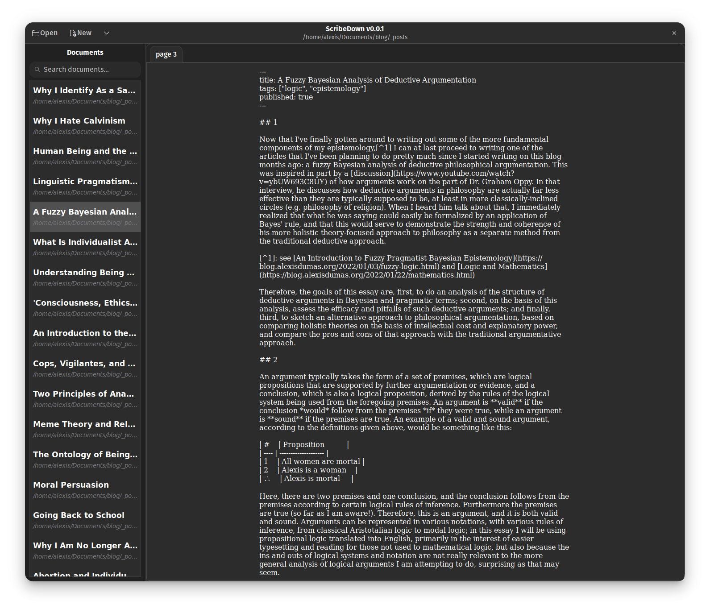

# ScribeDown

Current version: `v0.0.1`
Feature level: [See the roadmap](#roadmap)

## Beautiful, Clean, Writer-Oriented

The goal of ScribeDown is to make Markdown the best, cleanest, nicest
experience for those who are, like myself, using it to write books, blog posts,
and other non-code-oriented things. Most Markdown editors are based on a
split-view paradigm, and look like code editors on one side and web pages on
the other, which really isn't pleasant for writing and proof-reading, and also
isn't the norm for traditional word processing, which most people who are
writing books and blog posts are typically more familiar with. ScribeDown
changes all of this by orienting itself around a few core features:

### 1. What You See Is What You Get

Scribedown is WYSIWYG editor that uses Markdown under the hood as a
highly-compatible back-end, but it tries to not expose that too much.

As you write Markdown formatted text, it displays that text with different font
sizes, weights, indentation levels, etc, in order to give you a preview,
inline, of what the final document will look like when rendered.

It also has keyboard controls similar to those used in traditional word
processors to insert Markdown formatting, so you don't need to know Markdown at
all.

Additionally, the text entry area in ScribeDown is centered, padded, and in a
serif font, so it's designed to be as readable as possible, looking like an
actual finished word-processing document instead of a code file.

### 2. Document-Oriented

ScribeDown lets you open an entire directory, so that all of the Markdown
documents in that directory are put into your sidebar, to be opened in your
current tab or in a new tab. Not only that, but instead of treating documents
like code files, ScribeDown reads either the first H1 or the YAML `title`
property from each Markdown file in your project directory, and uses that as
the file's title.

### 3. Simple GUI Interface

Another focus for ScribeDown is having a clean, simple, beautiful user
interface around your document and integrates well with the surrounding Desktop
Environment. In order to do this, we have to sacrifice some platform
interoperability, by choosing a DE to target. We chose GNOME.

## Roadmap 

### Version 0.1.0 Roadmap
- [X] Open project folder
- [X] Get list of markdown documents in project and display them on the sidebar
- [X] Display markdown file title from top header or YAML metadata in document
list
- [X] Open document contents when clicked in the side bar
- [ ] Search through files in document list
- [ ] When a file is clicked, open in new tab or switch to tab
- [ ] Allow closing tabs
- [ ] Create new file when "New" button is pressed
- [ ] Save file contents on <kbd>Ctrl</kbd> + <kbd>S</kbd>
- [ ] Undo and redo key commands
- [ ] Update file title when file is changed in document list sidebar
- [ ] Parse tags from YAML metadata for each document and display them in the
document list rows
- [ ] Filter documents by tag
- [ ] Open file by name using <kbd>Ctrl</kbd> + <kbd>P</kbd>
- [ ] Parse markdown and get text ranges for each formatting
- [ ] Create tags for those ranges depending on what they are, and add them to
  the textview
- [ ] Update parsing and tags every time a change is made

### Version 0.2.0 Roadmap

- [ ] Automatically fold YAML metadata
- [ ] Hide Markdown formatting entirely except when adjacent to cursor
- [ ] Get document outline and display in alternate sidebar tab

### Version 0.3.0 Roadmap

- [ ] Dialog to view and modify basic YAML metadata for a file
- [ ] Programmable dialog to to publish projects
- [ ] Store project metadata
- [ ] Store application state, such as what files are open

## Demo videos

[Alpha v0.0.1 demo](https://raw.githubusercontent.com/alex-dumas/scribedown/master/AlphaDemo.mp4)
